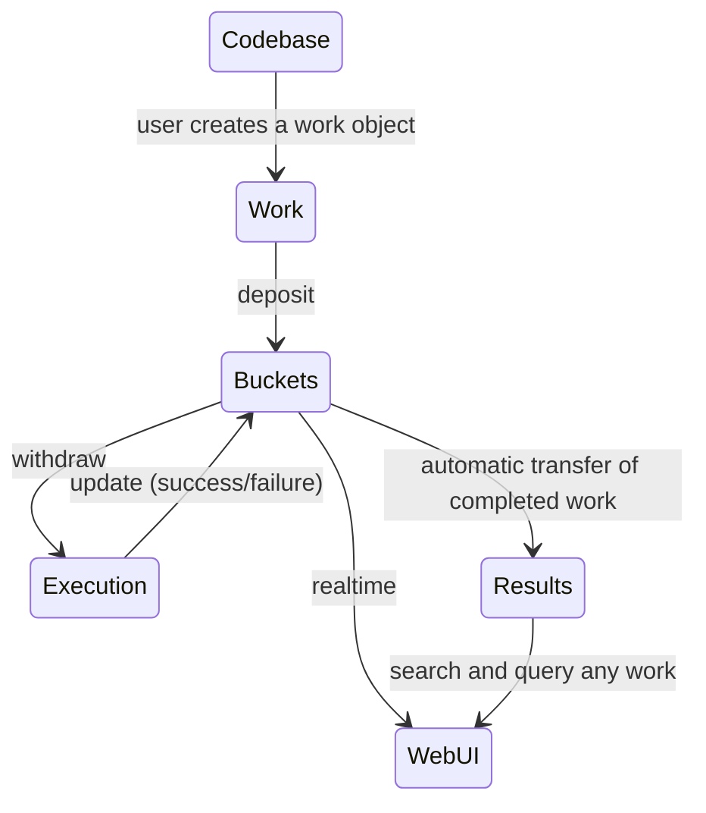

# What is the Workflow System?

Workflow is an over-arching framework to manage the lifecycle (execution, state machine chaining, query of results) of any process agnostic of the underlying parameters such as hardware, software, physical constraints etc.

## Philosophy

The core tenant of workflow is to provide impeccable bookkeeping. It acts as a singular coordination layer for performing any task through a simple and intuitive interface. At the core of the workflow system is the `Work` object which consists of a generic set of metadata that can be used to describe any action performed by the system. The workflow system manages the entire lifecycle of a single or collection of work objects, from their creation to its completion. The user can then query the workflow framework to get the input parameters or results of the work at any point.

## Architecture

The workflow system is designed to be modular and extensible. It is composed of six main components:

1. User Codebase
2. `Work` object.
3. Buckets Backend.
4. Results Backend.
5. Pipelines Backend.
6. Workflow Web User Interface.



## Usage

### Define `Work`

The `Work` object at the core of the workflow system is simply a python dictionary object which contains all parameters that can be used to define a task at the telescope. The `Work` object is defined as follows:

```python
from chime_frb_api.workflow import Work

work = Work(pipeline="sample-pipeline", parameters={"a": 1, "b": 2})
```

At a minimum, the `Work` object requires only requires the `pipeline` parameter. Additional lifecycle are automatically added to the `Work` object as it progresses through the workflow system. At any time in its lifecycle, you can see all the parameters in the `Work` object by simply running,

```python
work.payload
{
    "pipeline": "sample-pipeline",
    "parameters": None,
    "results": None,
    "path": ".",
    "event": None,
    "tags": None,
    "group": None,
    "timeout": 3600,
    "retries": 2,
    "priority": 3,
    "products": None,
    "plots": None,
    "site": "local",
    "user": None,
    "archive": True,
    "precursors": None,
    "config": None,
    "id": None,
    "creation": 1673298165.260349,
    "start": None,
    "stop": None,
    "attempt": 1,
    "status": "created",
}
```

This dictionary is the exact representation of the `Work` object in the database.

### Deposit `Work`

To deposit the `Work` object into the workflow system, simply run,

```python
work.deposit()
```

### Perform Work

`Work` is usually performed by a user provided python function. This function can be run anywhere, but it is recommended to run it in a container. In future releases of the workflow system, we will provide a container orchestration layer to run the function at any scale or any telescope site and also at Compute Canada sites.

To perform a unit of work, the user needs to withdraw the work, perform it, update it with the results and finally deposit it back to the workflow system. This can be done manually by the user, or it can also be done automatically by the workflow system using the `workflow run` CLI command.

### User Provided Function

Lets say we have the following function, that you wish to run,

```python
# Function that performs the work.
# We assume that this function is availaible as an import.
def add(a: int, b: int) -> int:
    result = a + b
    return result
```

#### Manual Withdraw and Deposit

```python
from chime_frb_api.workflow import Work

work = Work.withdraw(pipeline="sample-pipeline")
result = add(**work.parameters)
work.results = result
work.status = "success"
work.update()
```

#### Automatic Withdraw and Deposit

```bash
workflow run add sample-pipeline
```

The simplest and preferred way to run a user function is throught the `workflow run` CLI Command. This command will automatically withdraw the work, perform the work by passing the `parameters` field to the user function, and then deposit the results returned back into the workflow system.

#### CLI Command: `workflow run`

```bash
workflow run {pipeline-name} {module.submodule.function}
```

where,

* `pipeline-name`: the name of the pipeline. This defines what work will be withdrawn by the running pipeline.

* `module.submodule.function`: the full python specficication of the pipeline function that will be ran.

The pipeline CLI assumes that the pipeline function follows the [CHIME/FRB pipeline interface specification](https://chimefrb.github.io/guidelines/pipeline_interface/). That is, it takes keyword arguments as inputs and outputs a `results` dictionary, a `products` list of paths to output files, and a `plots` lists of paths to output plots.

Example for header localization persistent container:

```bash
poetry workflow run header-localization frb_l2l3.utils.header_localization.main
```

## Recommended Fields

It is strongly recommended to use the maximum number of fields in the work object. This will make it easier not only to manage the workflow, but also to manage retrieve the results of the work once completed.

```python
work.event = [12345, 67890]
work.user = "some-user"
work.tag = ["some-tag", "some-other-tag"]
work.group = ["some-working-group", "some-other-working-group"]
work.site = "chime"
```

```python
work.results = {"some-parameter": "some-value"}
work.plots = ["some-plot.png"]
work.products = ["some-product.fits"]
work.status = "success"
```

For a full list of parameters that can be set in the Work object see [Work Object](work.md).
