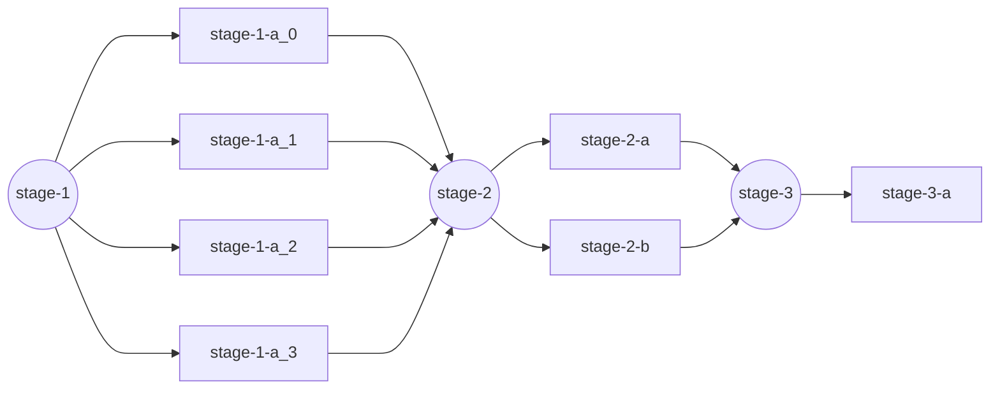

# Pipeline configuration flow

Let's use the following pipeline configuration as an example to explain the current flow it will follow.

```yaml
version: "1"
name: "demo"
pipeline:
  stage-1-a:
    stage: 1
    matrix:
      job_id:
        range: [1, 2]
      site: ["aro", "canfar"]
    work:
      site: ${{ matrix.site }}
      parameters:
        job_id: ${{ matrix.job_id }}
  stage-2-a:
    stage: 2
    work:
      command: ["ls", "-la"]
      site: "local"
      event:
        - 253483080
  stage-2-b:
    stage: 2
    work:
      command: ["ls", "-la"]
      site: "local"
  stage-3-a:
    stage: 3
    work:
      site: "local"
      command: ["ls", "-la"]
      tags:
        - tag1
        - tag2
      event:
        - 253483080
```

There are 4 step definitions on the pipeline configuration, each step contains a `stage` key:

- On stage 1 there is the step `stage-1-a` with a `matrix` strategy
- On stage 2 there are the steps `stage-2-a` and `stage-2-b`
- On stage 3 there is the step `stage-3-a`

If there are several steps that have the same `stage` of execution, these will execute concurrently.

The step `stage-1-a` contains a `matrix` definition, this means that the step will have replicas, following the strategies defined on the `matrix`:

- `job_id` will have values `[1, 2]`
- `site` will have values `["aro", "canfar"]`

This means there will be 4 replicas for `stage-1-a` with different values for parameters `job_id` and `site`:

- `(1, "aro")`
- `(1, "canfar")`
- `(2, "aro")`
- `(2, "canfar")`

# Execution flow


